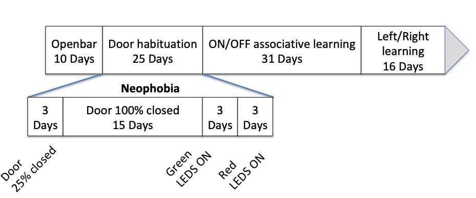

```{r setup, include=FALSE}
knitr::opts_chunk$set(echo = TRUE)
```
#0- To do
- use experimentator tag's presentation instead of timline time as the onset for neophobia beginning. It requires reprocessing the data from scratch and creating a new compiled dataset keeping the experimentator tag in the preprocessed data.
- compute habituation time: time needed to go back to a baseline feeding rate

#1- Protocole
There are 4 different scenari in the protocol that could be used to assess neophobia:
- 2 motor only: Door close 25% and Door close 100% 
- 2 visual only: GREEN LEDS ON and RED LEDS ON
Birds are used to feed from a hole fully hopen during 10 days (Openbar). In the Door close 25% senario, the hole is allways 25% closed by the door and as soon as a bird perch on the antenna and his PITtag is recognised the door move to give a full access to the hole. In the senario Door close 100% the task is similar except that the hole is now totaly closed by the door before a bird perch on the antenna. During the visual only neophobia task we assume that birds are now used to door movement after 15 days of Door 100% and we use the 4 LEDS placed arround the feeding hole to produce a different kinds of neophobic signal. For 3 days the 4 LEDS are constantly switch on in GREEN and then in RED for a consecutive period of 3 days.

# 2- Analysis plan
We first want to see if neophobic stimuli change bird behaviour at the population level:
- is the number of birds present at the feeder changed by neophobic stimuli?
- is the delay between neophobic stimuli onset and first visit (time2return) longer than average inter trial interval (meanITI)?
- is the daily/hourly visit rate modified by the neophobic stimuli?

We then would like to estimate neophobia at the inidividual level:
- is the delay between neophobic stimuli onset and first visit (time2return_ID) longer than average inter trial interval (meanITI_ID) at the individual level?
- is the daily/hourly visit rate modified by the neophobic stimuli at the individual level?
- are those neophobic repeabtle between all task and within task modality (visual/motor)?

For each analysis, we would like to control for elevation and species and evaluate both the effect of the baseline and neophobic time window used.


### Figure 1: Experimental protocole 



#2- Load data
## Load preprocessed data
```{r load, echo=FALSE}
d=read.table('/Users/maximecauchoix/Documents/openfeeder/data/StudySite_2018_19.csv',h=T)
head(d)
### Only keep

```
## Load timeline 
ec=read.csv2('/Users/maximecauchoix/Documents/wild_cog_OF/logistique/OF timeline.csv')
ec=ec[,1:7]
ec$dayDate=as.Date(ec$Day,"%d/%m/%y")# convert date
head(ec)

#3- Compute 


## Including Plots


```{r pressure, echo=FALSE}
plot(pressure)
```


